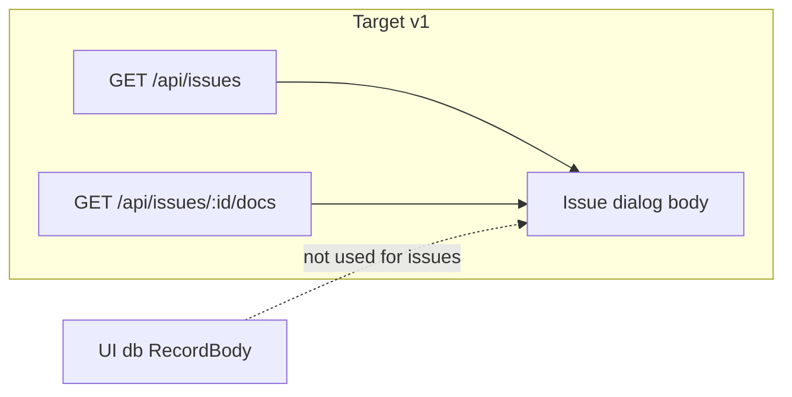

# ADR 0057: Issue dialog long-form docs (read projection)

**Status:** Proposed
**Date:** 2026-10-02
**Issues:** TRL-466 (proposal) · TRL-467 (spec) · [`trellis-admin-issue-docs.md`](../specs/trellis-admin-issue-docs.md)
**Depends on:** [0053](./0053-admin-operator-api.md) (operator API reads and two data planes)
**Related:** [0040](./0040-lane-boundary-oss-and-hosted-platform.md) (engine upstream of turtleOS),
[0044](./0044-plan-artifact-capture.md) (repo `docs/` conventions)
**Amends:** [0053](./0053-admin-operator-api.md) §2 (reads), §6 (two data planes)
**Supersedes:** nothing
**Impacted components:** `src/vcs/issue-doc.ts`, `src/ui/lanes-dashboard.ts`,
`os/admin` (`src/lib/issues/*`), `@turtle.tech/app-svelte` record dialog / block editor

## Context

turtleOS **turtle-admin** (`os/admin`) renders VCS issues via `GET /api/issues` and
opens each issue in a **record dialog** that reuses the generic `Record:page`
projection. Ground truth in the app platform:

| Fact | Location |
| ---- | -------- |
| Issues app has no graph schemas; issues from `/api/issues` | `os/admin/src/lib/issues/app.ts` |
| `description` hidden in properties while body is empty | `os/admin/src/lib/issues/catalog.ts` |
| Kernel knows `summary.md` only; no `journal.md` helper yet | `kernel/src/vcs/issue-doc.ts` |
| Dialog layout + body editor | `lab/.../app-svelte/src/components/entity/projections/record-page.svelte` |
| `RecordPage` subscribes to UI-db `RecordBody` | `lab/.../app-svelte/src/browse/app/record-page.svelte.ts` |
| Empty-body placeholder | `lab/.../app-svelte/src/components/entity/page/record-extensions.ts` |
| `BlockEditor` supports `readonly` | `lab/.../app-svelte/src/components/entity/page/block-editor.svelte` |
| `ThingContext` accepts additive flags | `lab/.../app-svelte/src/browse/thing/types.ts` |

The issues app deliberately registers **`schemas: []`** and does not persist issues in
the UI db. Issue metadata comes from the op-log; the TipTap body slot is **unwired**,
not empty because the issue has no narrative.

Long-form issue content on disk:

| Artifact | Path | Kernel today |
| -------- | ---- | -------------- |
| Spec / AC mirror | `docs/issues/<id>/summary.md` | `trellis issue doc` scaffolds via `issue-doc.ts` |
| Pipeline journal | `docs/issues/<id>/journal.md` | Agent/pipeline convention only; no helper |
| Short blurb | `issue.description` in op-log | Returned on `/api/issues`; hidden in admin catalog |

ADR **0053 §6** separates **issue truth** (op-log) from **UI state** (views, record
pages, tags). Editable dialog autosave into `RecordBody` would fork long-form text away
from git.

**Intent:** Show repo markdown in the issue dialog body as a **read-only operator
projection**, journal-primary and summary-secondary, without mirroring into the UI db.



## Decision

### 1. Write semantics

For **`appId === 'issues'`**, the dialog **body is read-only** in v1.

- No `RecordPage.save`, no `RecordBody` create/update, no TipTap `onChange`
  persistence to the UI db.
- **Mechanism (required):**
  1. Set `ThingContext.recordBodyMode: 'operator-docs'` when building record
     context for the issues database (`record-context.ts`).
  2. In `record-page.svelte`, when `recordBodyMode === 'operator-docs'`:
     - Pass `readonly={true}` to `BlockEditor` and **omit** `onChange`.
     - **Do not** use `pages.page(id)` / `RecordPage` for body content (operator-docs
       loader supplies markdown instead).
  3. **Bypass the write data path:** in `operator-docs` mode, **do not construct**
     `RecordPage` with a live `entityMutations(client, RecordBody)` subscription
     (`record-page.svelte.ts` holds the bodies store). Read-only rendering alone is
     insufficient — subscription must not run.
- A dedicated `Record:issue-docs` projection is **optional** (belt-and-suspenders);
  the flag + skipped `RecordPage` body path is sufficient.
- **Non-goal v1:** Editable body autosaving to UI-state `RecordBody`.

Append-only edits to `journal.md` remain **CLI / IDE / agent** until a future ADR
defines an HTTP append verb.

### 2. Empty-state ladder

**“Present”** for a markdown file means: path resolves and reads successfully **and**
`content.trim().length > 0`. A whitespace-only `journal.md` **does not** win the
ladder; fall through to `summary.md`, then `description`, then empty state.

The server computes **`rendered`**; the client **must** use `rendered` (and the
matching field) as authoritative — no client-side re-ladder (avoids divergence).

| Step | Condition | `rendered` |
| ---- | --------- | ---------- |
| 1 | `journal.md` present (non-empty after trim) | `journal` |
| 2 | else `summary.md` present (non-empty after trim) | `summary` |
| 3 | else non-empty `issue.description` from op-log | `description` |
| 4 | else | `none` |

**Empty copy (step 4):** “No long-form docs yet. Run `trellis issue doc <id>` to
scaffold `summary.md`; agents append `journal.md` in the same directory.”

**Properties UX:** When `rendered === 'description'`, **unhide** `description` in the
issues catalog. When `journal` or `summary` fills the body, `description` may stay
hidden if redundant.

**Journal vs summary:** If `journal` wins, the body shows **journal only** in v1 (no
merged stream). P2 may add “View spec” for summary separately.

### 3. Assets and wiki-links (v1 degraded)

Relative images, `[[wiki-links]]`, and cross-issue references **may not resolve** in
the admin dialog in v1.

- **Out of scope v1:** `GET /api/issues/:id/docs/assets/<name>` or directory listing.
- **P2 (open):** Confined static serve under `docs/issues/<id>/` only.

### 4. Path helpers and CLI scope

Kernel **`src/vcs/issue-doc.ts`** grows:

- `assertIssueDocId(id)` — after stripping `issue:` and trim, bare id must match
  `/^[A-Za-z0-9][A-Za-z0-9._-]*$/`; reject `.`, `..`, empty, and ids that sanitize
  to empty. Used by HTTP handler **before** path join (decoded `%2e%2e` must fail here).
- `issueDocsRoot(rootPath)` → absolute `join(rootPath, 'docs', 'issues')` (fixed
  confinement root; trailing separator for prefix checks).
- `issueDocJournalPath(rootPath, id)` → `join(issueDocsRoot, <safeDir>, 'journal.md')`
  where `<safeDir>` is the **single** path segment from validated id (not a nested
  `join` that re-introduces `..`).
- `readIssueDocFiles(rootPath, id, opts?)` → file contents + `truncated` per §6.

**`trellis issue doc`:** v1 **does not** scaffold `journal.md`.

**Embeddings:** `journal.md` uses generic markdown chunking; no `journal_md` special
case in v1.

### 5. Three-repo boundary

Per ADR **0040**, engine lands first.

| Repo | Responsibility |
| ---- | ---------------- |
| **trellis-node** (`kernel/`) | Helpers + route; security tests; amend 0053 |
| **turtlenote packages** (`app-svelte`, `app-sdk`) | `recordBodyMode`; skip `RecordBody` subscription; markdown init in `block-editor.svelte` |
| **turtle-admin** (`os/admin/`) | `AdminApi.getIssueDocs`; dialog wiring; catalog; **Playwright e2e harness** (P3) |

### 6. Endpoint contract

**Route:** `GET /api/issues/:id/docs`

| Case | HTTP | Body |
| ---- | ---- | ---- |
| Invalid issue id (fails `assertIssueDocId`) | `400` | `{ "error": "invalid issue id" }` |
| Unknown issue | `404` | `{ "error": "unknown issue: …" }` |
| Known issue | `200` | JSON below |

**Response (`200`):** `Content-Type: application/json; charset=utf-8`

```ts
{
  issueId: string;
  journal: string | null;
  summary: string | null;
  description: string | null;
  rendered: 'journal' | 'summary' | 'description' | 'none';
  truncated?: boolean;
  maxBytes: number; // 524_288 (512 KiB per file, v1)
}
```

- **Truncation:** Read at most `maxBytes` **at the fd** (do not read whole file then
  slice). Keep the **head**; cut on a **UTF-8 code-point boundary** (no split
  multibyte chars). Set `truncated: true` if the file exceeded the cap. `rendered`
  still reflects which file won the ladder (even if truncated).
- **Missing files:** `ENOENT` → field `null`, not an error for the whole request.

**Refetch (v1):**

- Always fetch on **dialog open**.
- Refetch on `/api/lanes/stream` **`snapshot`** while the dialog is open (same hook as
  `IssuesSource`).
- **Staleness:** `trellis admin` does **not** watch the filesystem. Snapshot SSE fires
  on **new ops** in the repo (typically via `trellis watch` ingesting edits). A
  `journal.md` edit that never becomes an op may stay stale until the dialog is
  **closed and reopened**. Do not promise live journal updates v1.

**Client version skew:** Older npm kernels may **404** `/docs`. turtle-admin must:
detect 404 (or missing route), fall back to `description` then empty-state ladder using
`GET /api/issues/:id` only, and surface serving build via snapshot **`stats.version`**
/ **`stats.source`** (0053 d7). Acceptance criteria on the admin wedge.

**Amendment to 0053:** §2 prose list of read projections includes
`GET /api/issues/:id/docs`. §6: long-form issue markdown is a **read-only repo
projection**, not UI-state pages.

### 7. File read security (normative)

`issueDocRelDir` replaces unsafe characters but **does not** reject `..` as a bare id
(`kernel/src/vcs/issue-doc.ts` allows dots). Prefix-checking against
`join(rootPath, issueDocRelDir(id))` is **self-referential** and allows
`docs/issues/..` → repo `docs/`. This ADR **supersedes** that pattern.

**Required algorithm:**

1. `assertIssueDocId(id)` on the URL segment (after `decodeURIComponent`).
2. **Confinement root:** `canonicalRoot = realpath(join(rootPath, 'docs', 'issues'))`
   (must exist or be creatable-only for reads — if missing, no files match; still
   validate ids). All allowed file paths must satisfy
   `resolvedFile.startsWith(canonicalRoot + sep)`.
3. Per file (`journal.md`, `summary.md`): `candidate = join(canonicalRoot, safeSegment, basename)`;
   `resolved = realpath(candidate)` when the file exists; if `ENOENT`, treat as absent
   (`null`). If resolved escapes `canonicalRoot`, **reject the read** (403 or omit field
   per implementation — tests must cover escape).
4. **Symlink:** resolved path must remain under `canonicalRoot`; symlink pointing outside
   → reject.
5. **Read:** bounded read at fd (`read` / `fs.read` with max length), then UTF-8 decode
   with boundary trim for truncation.

**Negative tests (required):** id `..`, id `%2e%2e` (decoded), symlink out of issue dir,
oversize file, whitespace-only `journal.md` (ladder falls to summary), invalid id → 400.

## Security

ADR 0053 **loopback bind + Host check** unchanged. This ADR adds disk reads on that
surface.

| Risk | Mitigation |
| ---- | ---------- |
| Path traversal / `..` id | `assertIssueDocId` + fixed `docs/issues` confinement root |
| Symlink escape | `realpath` + prefix under `canonicalRoot` |
| Huge / binary files | fd-level cap; UTF-8 decode |
| Network exposure | 0053 d1; no new auth v1 |

## Alternatives considered

| Option | Pros | Cons | Why not |
| ------ | ---- | ---- | ------- |
| **A — read projection (chosen)** | Git is source; matches 0053 | No in-app edit v1 | — |
| B — sync into `RecordBody` | Reuses editor save | Forks UI db | Violates 0053 §6 |
| C — editable + HTTP write | Notion-like | Append semantics | Defer |
| D — full asset proxy v1 | Images work | Scope + attack surface | P2 |

## Consequences

### Positive

- Issue dialog shows pipeline journals without a second store.
- Engine-owned contract; clients share one ladder via `rendered`.
- Read-only + no `RecordBody` subscription prevents silent divergence.

### Negative / tradeoffs

- Degraded images/wiki-links v1.
- Three-repo release train.
- Docs may be stale until reopen if edits are not op-logged.

### Follow-ups

- [x] Update `docs/adr/README.md` index
- [ ] Link TRL-N implementation issue(s) with label `needs-e2e`
- [ ] Link `admin/README.md` after **Accepted**
- [ ] Optional spec: `docs/specs/trellis-admin-issue-docs.md`

## Implementation phases

Verification bar for review (do not skip at PASS):

| Phase | Scope | Verification |
| ----- | ----- | -------------- |
| **P0 Engine** | `assertIssueDocId`, confined reads, route | `test/vcs/issue-doc.test.ts`; `test/ui/` (.., `%2e%2e`, symlink, oversize, whitespace journal); `pnpm check` |
| **P1 app-svelte** | `recordBodyMode`; no `RecordBody` subscription; markdown→editor init | **Vitest** unit test (e.g. markdown init helper); `pnpm test` in app-svelte — not manual-only |
| **P2 admin** | API client, dialog wiring, version-skew fallback, catalog | `bun run check` **and** `bun run test` in `os/admin` |
| **P3 E2E** | **Owner: `os/admin`.** Add `@playwright/test` config + fixture repo(s): issue with `journal.md`; issue with no docs. Assert rendered markdown and empty-state copy. Part of the same wedge — kernel Playwright cannot drive the turtleOS dialog. | `needs-e2e` on TRL-N; `bun run test:e2e` (script added in admin) |
| **Review** | UI wedge | QA subagent before Reviewer PASS |

**ADR acceptance:** Status moves to **Accepted** by human/architect sign-off after
review (reviewer PASS on the ADR text does not alone change status). Implementation
follows Accepted unless an explicit spike waiver is recorded in the issue.

## Open questions

- **P2 asset route:** confined `GET .../docs/assets/<basename>`?
- **`trellis issue doc --journal`:** empty stub?
- **Embeddings:** `journal_md` chunk type?

## Addenda

<!-- Append dated notes here. Do not rewrite accepted decision text above. -->

### 2026-10-02 — Reviewer consult (security, e2e owner, staleness)

Captured blocking fixes: `assertIssueDocId` + fixed `docs/issues` confinement (not
`issueDocRelDir` prefix alone); fd-level read cap; admin-owned Playwright; refetch
staleness when files are not op-logged; client 404 fallback; whitespace ladder;
`rendered` authoritative; skip `RecordBody` subscription in `operator-docs` mode.
