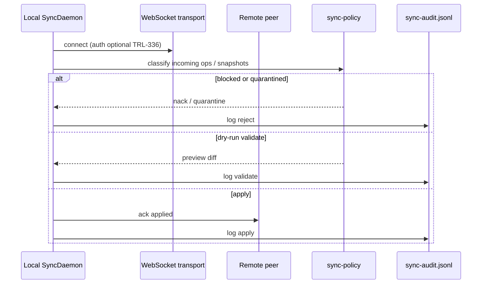

# TRL-334 — Spec: Realtime full-state sync with safety layers

Parent: **TRL-333** (proposal). Backend path — no `needs-design`.

## Problem

HTTP push/pull sync moves **integration oplog** only. Sandboxes and peers need **full graph materialization** (kernel DB snapshot, lane journals, decision traces, entity deltas) over the existing sync room, with **safety gates** so destructive remote ops cannot apply by default.

## Non-goals (v0)

- CRDT / concurrent merge (linear replay first)
- Multi-room mesh (one repo pair per connection)
- Replacing ephemeral realtime presence SDK

## Architecture



## Agent read surface (H2 — landed 2026-09-22)

Harness agents read graph state via **typed tools** only — no freeform EQL-S in the
agent tool surface:

| Tool | Path |
|------|------|
| `list_entities` / `get_entity` | `src/core/agents/typed-graph-tools.ts` |
| DevTools LLM bridge | `src/llm/devtools-provider.ts` |

EQL-S remains kernel IR for Studio/SDK. os eval default arm = typed graph;
frozen EQL-S baseline = `--arm=graph-strict`.

## Surfaces (authoritative paths)

| Area | Path |
|------|------|
| Message types | `src/sync/types.ts` (`graph-snapshot`, `lane-journal`, `decision-trace`, `entity-delta`) |
| Engine / room | `src/sync/sync-engine.ts`, `src/sync/room-core.ts` |
| Daemon | `src/sync/sync-daemon.ts` |
| Transport | `src/sync/websocket-transport.ts` |
| Safety | `src/vcs/sync-policy.ts` |
| Audit | `src/sync/audit-trail.ts` → `.trellis/sync-audit.jsonl` |
| CLI | `src/cli/sync-cli.ts` (`trellis sync …`) |

## Delivery slices (executor order)

### Slice 1 — Protocol + policy + audit (in tree; harden)

- Types compile and protocol extension tests pass.
- `SyncAuditTrail` appends JSONL lines for sync events.
- `sync-policy` blocks/quarantines per risk class; unit tests green.

### Slice 2 — Daemon + WebSocket wire-up

- `SyncDaemon` persistent loop: connect, tail local ops, push/pull full-state messages.
- Integrate `websocket-transport` with existing `SyncEngine` handshake.
- Rate limit + quarantine counters exposed on `getState()`.

### Slice 3 — CLI + checkpoint / rollback

- `trellis realtime-sync start|status|pause|rollback` (VCS `trellis sync` remains push/pull).
- `trellis realtime-sync integrate <file> --mode dry-run|validate|apply` — checkpoint under `.trellis/sync-checkpoint.json` before apply; `rollback` restores last checkpoint.

### Slice 4 — Integration

- Round-trip test: two temp repos, WS room, snapshot + lane journal exchange, policy blocks destructive remote op by default.

## Acceptance criteria (machine)

```text
test:pnpm check
test:npx vitest run test/sync/sync-protocol-extensions.test.ts
test:npx vitest run test/sync/sync-daemon.test.ts
test:npx vitest run test/vcs/sync-policy.test.ts
test:npx vitest run test/p7/sync-engine.test.ts
```

Behavioral (prose — verified in review):

1. Remote destructive VCS ops are **denied by default** unless policy explicitly allows environment.
2. Every apply/validate/quarantine path writes an **audit** line when audit enabled.
3. Full-state messages are **versioned** (`version: 1`) and nack on schema mismatch.

## Graph hygiene

TRL-334 currently has **duplicate** audit AC rows on the issue — retract duplicates and replace with the five machine AC above before impl close.

## Teach

Full-state sync is **not** a second op-log: snapshots and lane journals are **bulk frames** around the same policy gate used for incremental ops. Safety layers run **before** SQLite apply.
