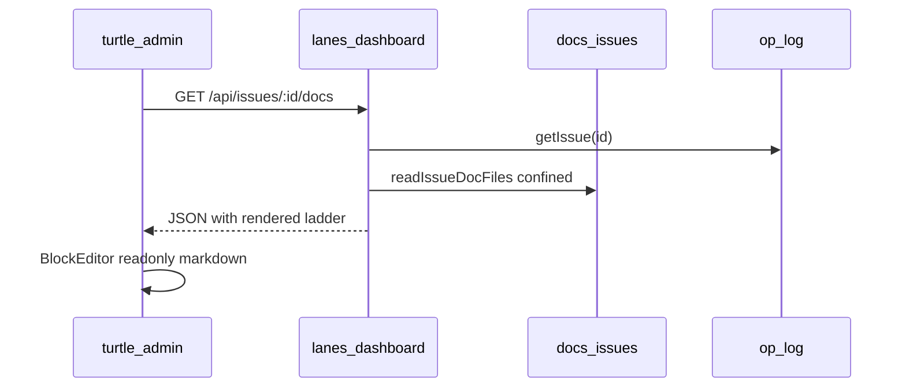

# TRL-467: Spec — turtle-admin issue dialog long-form docs (read projection)

**ADR:** [0057-issue-dialog-docs-read-projection](../../adr/0057-issue-dialog-docs-read-projection.md)  
**Spec:** [trellis-admin-issue-docs.md](../../specs/trellis-admin-issue-docs.md)  
**Parent proposal:** TRL-466  
**Labels:** `spec`, `admin`, `needs-e2e`, `cohesion`

## Contract summary

- **Read:** `GET /api/issues/:id/docs` — journal → summary → description → `none` (`rendered` authoritative).
- **Write:** None v1. No `RecordBody` subscription when `recordBodyMode === 'operator-docs'`.
- **Security:** `assertIssueDocId`, confinement under `realpath(docs/issues)`, fd cap 512 KiB.
- **E2E owner:** `os/admin` Playwright (`bun run test:e2e`).

## Data flow



## Acceptance criteria

```text
test -f docs/specs/trellis-admin-issue-docs.md
grep -q assertIssueDocId docs/specs/trellis-admin-issue-docs.md
grep -q '/api/issues/:id/docs' docs/specs/trellis-admin-issue-docs.md
grep -q recordBodyMode docs/specs/trellis-admin-issue-docs.md
grep -q RecordBody docs/specs/trellis-admin-issue-docs.md
grep -q rendered docs/specs/trellis-admin-issue-docs.md
grep -q 'bun run test:e2e' docs/specs/trellis-admin-issue-docs.md
grep -q 0057 docs/specs/trellis-admin-issue-docs.md
```

Executor closure (after impl):

```text
test:pnpm check
test:pnpm test test/vcs/issue-doc.test.ts
test:pnpm test test/ui/issue-docs-api.test.ts
test:cd ../admin && bun run check && bun run test
test:cd ../admin && bun run test:e2e
```

## Deps map

| Repo | Paths |
| ---- | ----- |
| trellis-node | `src/vcs/issue-doc.ts`, `src/ui/lanes-dashboard.ts`, `test/vcs/issue-doc.test.ts`, `test/ui/issue-docs-api.test.ts` |
| app-svelte | `record-context.ts`, `record-page.svelte`, `block-editor.svelte`, `thing/types.ts` |
| admin | `src/lib/issues/api.ts`, catalog, e2e harness |

## Teach

ADR 0057 separates **op-log issue truth** from **git long-form docs**. The admin dialog
today uses UI-db `RecordBody` (empty for issues). This spec wires a read projection so
pipeline `journal.md` files show in the dialog without forking state into `trellis db`.
