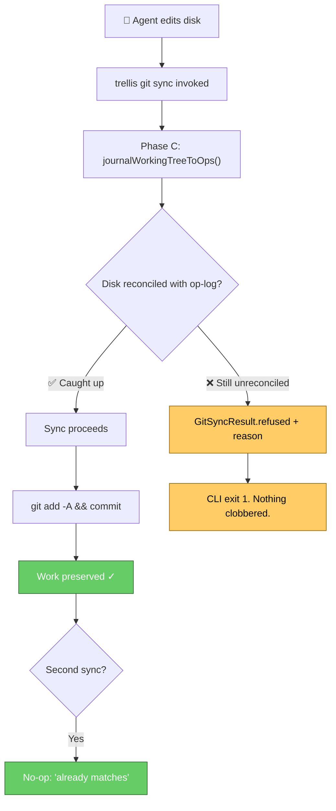
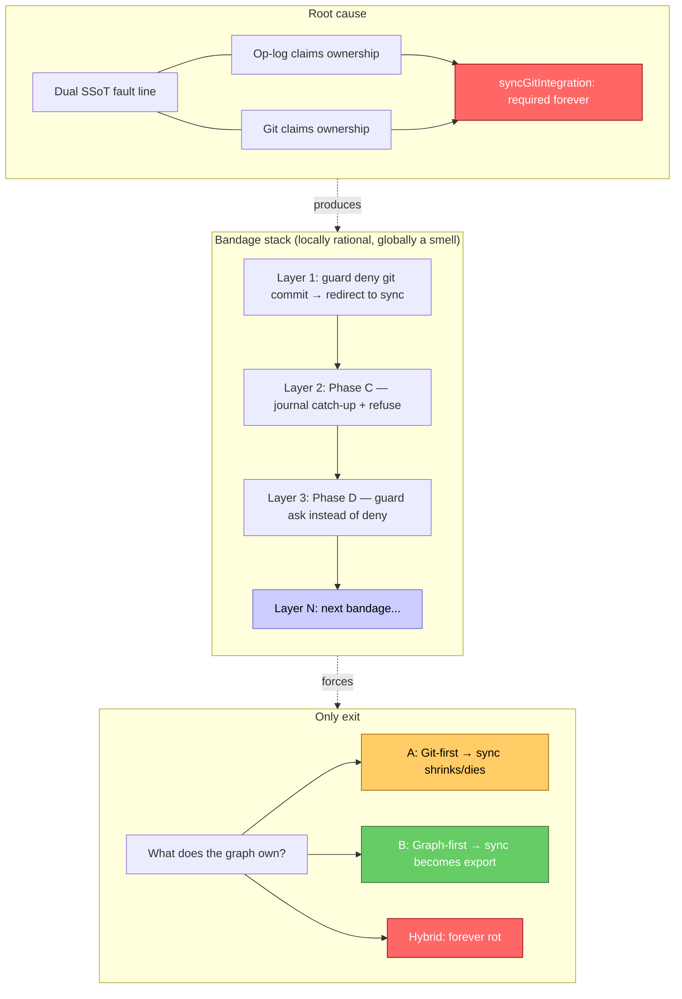
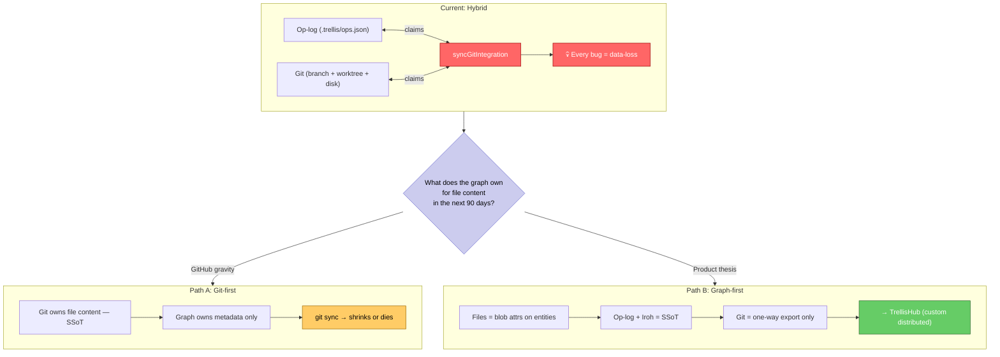
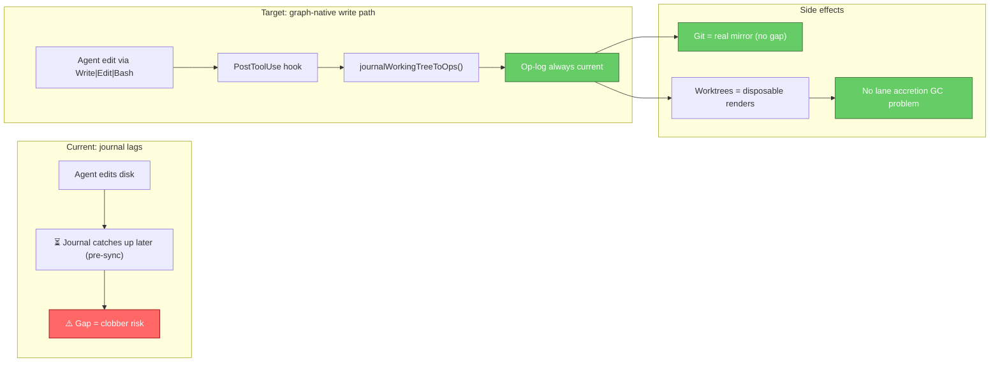

# Checkpoint: git ↔ op-log fault line (2026-08-03)

> **Status:** PAUSED — safety floor shipped; local ownership decided (B / graph-first). Next: graph-native write path (PostToolUse hook). TrellisHub deferred as separable distribution problem.
> **Tone:** get it right, not quick. Do not resume with more bandages until the ownership question is answered.
> **Studio / turtlecode fork:** OFF LIMITS until separately cleaned up. Do not touch.

---

## One-line summary

We proved a silent data-loss class (`git sync` materializes stale op-log over newer disk),
shipped a **refuse-before-clobber** floor in the kernel, and stopped — because the dual-SSoT
fault line is architectural rot, not a missing feature.

---

## What happened (the trap)

### Class name
**9801056-class silent revert** — named after an earlier regression commit that wiped work
and left a "clean" tree.

### Mechanism
1. Agent edits land on disk (and sometimes git-staged) **without** being journaled into the op-log.
2. Lane journals for this session were empty (0 ops). Kernel op-log file-state frozen ~Jul 26–31.
3. Lane guard blocked agent `git commit` → redirected to `trellis lane promote` → `trellis git sync`.
4. `syncGitIntegration` did: `buildFileStateAtOp` (stale) → `materializeToDisk` (overwrite) →
   `git add -A` + commit → **silent revert**. Working tree looks clean. Work is gone.

```mermaid
flowchart LR
    subgraph write["Write gate: broken"]
        A["🐢 Agent edits disk"] --> B["⚠️ NOT journaled"]
    end
    subgraph guard["Guard redirect"]
        B --> C["Lane journals: 0 ops"]
        C --> D["git commit → DENY"]
        D --> E["redirect → lane promote → git sync"]
    end
    subgraph clobber["Clobber path"]
        E --> F["buildFileStateAtOp(stale)"]
        F --> G["materializeToDisk(OVERWRITE)"]
        G --> H["git add -A && commit"]
    end
    subgraph result["Result"]
        H --> I["💀 Silent revert"]
        I --> J["Tree 'clean'. Work gone."]
    end

    style I fill:#f66,stroke:#900,color:#fff
    style J fill:#f66,stroke:#900,color:#fff
    style B fill:#f96,stroke:#930,color:#000
    style F fill:#f96,stroke:#930,color:#000
    style G fill:#f66,stroke:#900,color:#fff
```



### Proof (Phase A simulation)
- Copy: `/var/folders/.../T/opencode/sim-kernel`
- Committed 14 kernel files, ran local CLI `bun src/cli/index.ts git sync -p SIM`
- Result commit `7c0e0f6`: 74 files, −8613/+4345, `engine.ts` 3239→3006 lines,
  `reentryStatus` 1→0, tree "clean". Exact reproduction of the 9801056 class.

### What is NOT a fix path
- `trellis import --from . --path .` — **destroys** ops.json (wholesale overwrite at
  `src/git/git-importer.ts` ~301–303). Never use as catch-up on a live op-log.
- Promoting empty lane journals — unblocks nothing; journals had 0 ops.
- More guard redirects into the same sync path without journaling first.

---

## What shipped (safety floor)

### Kernel commit
- **Hash:** `b941575` on `main` (pushed to `origin/main`)
- **Note:** commit message is a pasted session dump (ugly but content is correct).
- **Contents (16 files, +1375):**
  - Desk/authority kernel work: `src/vcs/authority.ts`, `transcript.ts`, reentry checkpoints,
    decompose/sync-policy/types, planning doc, tests
  - **Phase C floor:**
    - `journalWorkingTreeToOps({ branch? })` in `src/engine.ts`
      — scan disk via FileWatcher, diff vs `buildFileStateAtOp`, journal
      fileAdd/fileModify/fileDelete, **advance the sync-target branch** to last op
    - `syncGitIntegration` is **async**: catch-up first, **hard-refuse**
      (`GitSyncResult.refused` + `reason`) when still unreconciled
    - CLI `git sync` + milestone auto-commit await + exit 1 on refuse
    - `test/git/git-sync-catchup.test.ts` (4 tests)

### Phase C verification (sim-kernel3)
- Same scenario as Phase A with the fix loaded
- Content **survived** (`reentryStatus=1`, `authority.ts` PRESENT)
- Sync commit carried the work; second sync = no-op ("already matches integration")
- Mid-flight fix: first attempt (sim-kernel2) journaled onto `issue/TRL-421` (currentBranch)
  while sync resolves **main** head — added explicit branch-advance of the **sync-target** branch

### Invariant that shipped (survives any redesign)
> **The op-log may never materialize over state it has not journaled.**
> Catch-up when possible; **refuse** when not. Never silent clobber.



### Guard patch (on disk, not kernel-repo)
File: `~/.cursor/hooks/trellis-lane-guard-lib.mjs` (shared by Cursor + opencode plugin)

| Command | Permission |
| ------- | ---------- |
| `git commit` | **ask** (message points at `trellis git sync`, which now journals first) |
| `stash push/pop/apply/drop/...`, `checkout`, `switch`, `merge`, `rebase`, `reset`, `cherry-pick`, `pull`, `fetch -all` | **deny** |
| bare `git stash` / `git stash list` | **allow** (read-only; fixed false positive) |
| `trellis git sync`, `git add`, tests | **allow** |

**Caveat:** long-lived opencode sessions cache the lib in memory. Restart session to load
the new behavior. Plugin throws on non-`allow` (so `ask` still surfaces as a blocking
message to the agent — "safer" semantics the human chose).

### Health at pause
| Surface | State |
| ------- | ----- |
| Kernel tree | clean, `b941575` == `origin/main` |
| `pnpm check` | clean |
| `pnpm test` | 1752/1756 — only 4 failures are pre-existing `test/core/workflow-pipeline-primitives.test.ts` (DAG 30s timeouts + orchestration; untouched) |
| dist | rebuilt; contains `journalWorkingTreeToOps` (gitignored, local) |
| Studio / turtlecode fork | **OFF LIMITS** — messy in-flight staged set (~1600 files), desk hooks/TUI work existed untracked/partially staged; do not resume from this checkpoint without a separate fork cleanup |

---

## The rot (name it so we don't forget)

### Dual SSoT fault line
Two kings on one board:

1. **Op-log** (`.trellis/ops.json`) — files as entities, causal stream, product thesis
2. **Git** (branch + worktree + disk) — what humans and most tools actually edit

`syncGitIntegration` exists only to reconcile them. Every bug in it is a **data-loss** bug.
The hybrid is the only mode that produces silent reverts.

### Lane accretion (symptom, not root)
At last count on kernel: **~231 git branches, ~306 lane dirs, ~187 worktrees**.
Lane GC does not prune git refs/worktrees. Session → lane → never cleaned.
Triplicated state per edit: journal + branch + worktree.

### Bandage stack (what we almost kept stacking)
```
agent edit → lane guard deny commit → promote → git sync → (was: clobber)
                                                      ↓
                              Phase C: journal catch-up + refuse
                                                      ↓
                              Phase D: commit → ask (not deny)
```
Each layer is locally rational. The stack is a smell that **ownership is undecided**.




### Related docs / ADRs
- `docs/planning/trellis-tui-fork-cycle.md` — desk cycle plan (Phases 0–4); kernel side partially shipped in `b941575`
- `docs/planning/lane-gc-regression-recovery.md` — prior 9801056-class recovery
- `docs/planning/oplog-safety-mirror-and-destructive-guards.md` — guard posture
- ADR 0014 — git as rebuildable blob-tree mirror (op-log is carrier of record)
- ADR 0015 — handoff protocol / lane ownership

ADR 0014 already says git is a **mirror**, not the carrier of record. Practice drifted:
agents edit git-first, journal lags, sync assumes op-log-first → clobber.

---

## The decision we did not make (on purpose)

**What does the graph own?**

| Endpoint | Files | Git's role | `git sync` |
| -------- | ----- | ---------- | ---------- |
| **A. Git-first** | git owns content | SSoT for code | shrinks or dies; graph tracks metadata (issues, milestones, links) |
| **B. Graph-first** | files = blob attributes on entities; op-log + Iroh | export/render only | becomes one-way export; no peer writer |
| **Hybrid (current)** | both claim ownership | "integration" peer | required forever; rot source |



Product thesis (local-first semantic graph OS, causal ops, Iroh) points at **B**.
Daily dogfood and GitHub gravity pull toward **A**.
The hybrid is how you get drunk on unrotting fruit.

**We paused rather than pick overnight.** Correct.

### Refined framing (2026-08-03, same session)

The A/B framing above conflates two separate axes:

| Axis | Question | Status |
|------|----------|--------|
| **Local ownership** | What's canonical on one machine right now? | **Decidable today.** No new infra required. |
| **Distributed sync** | TrellisHub/Iroh, multi-peer. | **Deferred.** A scaling concern; a lot to build solo. |

The paralysis read as "graph-first feels right but TrellisHub isn't built, so
maybe git-first for now" — but local ownership does not require distributed sync
to be solved.

**B is already the de facto answer**, codified twice:

1. **ADR 0014** — git as rebuildable blob-tree mirror, op-log as carrier of record
2. **Refuse-before-clobber** — `journalWorkingTreeToOps` treats disk drift as
   something to be *absorbed into* the op-log before anything proceeds, and
   refuses if it can't be reconciled. That **is** graph-first behavior: the
   op-log must reflect all reality; git is reconciled up into it.

So the unresolved question isn't "which one is canonical" — the shape of the fix
already answered that. The real question is: **what is the mandatory write path?**

#### The seam

Right now agents (Claude Code, opencode, etc.) edit files directly on disk. The
journal catches up *after the fact* via the disk scan in
`journalWorkingTreeToOps`, which currently only fires right before a sync. That
gap — writes bypassing the op-log — is the exact seam that produced the
9801056-class clobber.

#### The fix

Wire `journalWorkingTreeToOps` to a `PostToolUse` hook on `Write | Edit | Bash`
tool calls. The same scan-and-diff stops being a pre-sync patch and becomes the
**actual write path** — every agent edit is journaled immediately. Git falls
out as a real mirror, by construction, without touching TrellisHub.



#### Lane accretion: killed for free

Once a worktree is a disposable render of an op-log branch instead of a
first-class lane container, there's nothing to GC — you regenerate it when you
need it and throw it away when you don't, like a build artifact. This is the
"lane ≠ worktree forever" instinct from above, with a mechanism attached.

#### What this unblocks

| Unblocked | Rationale |
|-----------|-----------|
| Lane GC | Worktrees become ephemeral renders; no persistent ref pileup |
| Guard simplification | No deny-redirect-promote-sync chain; agent writes are journaled at source |
| Desk chrome | "Disk ahead of log" banners become the natural UX — the graph owns truth, disk is a view |
| TrellisHub | Remains a separable distribution problem, not gating local correctness |

**TrellisHub is now correctly a later problem** — about distribution, not about
who owns the truth. The truth is the op-log, locally, now.

### Consensus we keep re-reaching (2026-08-03 reminder)

Stated again in conversation, and believed to have been agreed **several times** before:

1. **Endgame is a custom distributed TrellisHub** — graph-native, op-log/Iroh shaped,
   not "GitHub with extra steps." Still open to it. Still the aim.
2. **Git was the meantime** — leverage it while building TrellisHub out, not as the
   permanent dual SSoT.
3. **TrellisHub never got built.** The meantime became the system. That is what we are
   feeling now (9801056-class, lane accretion, guard stack).
4. **Aim is engineering excellence, not speed.** Speed-forgetting is a recurring failure
   mode; write it down so the next session does not optimize for "ship the hybrid harder."

Avoiding git fights a strong current. So does anything worth doing. The mistake was not
choosing git as scaffolding — it was letting scaffolding become load-bearing without a
build schedule for the real structure.

**Implication for later work:** interim git use is allowed and expected; new investment
that *deepens* the hybrid (more sync glue, more lane↔worktree ceremony) is not — unless
it is explicitly on the TrellisHub path or the safety floor (refuse-before-clobber class).

---

## Instincts (not decisions) — leave for the next conversation

1. **The floor stays either way.** Refuse-before-clobber is not a bandage to delete; it is
   the honest behavior of any two-writer system and the export-safety check of a one-writer
   system. Do not rip Phase C out while redesigning.

2. **ADR 0014 is the north star we already wrote.** Git as mirror means practice must stop
   treating git commit as the primary write. Either make the watcher/journal actually catch
   every write (hard, races), or stop claiming files are graph-owned until the write path
   is graph-native.

3. **Lane ≠ worktree forever.** Isolation can be op-journal + virtual view without a git
   worktree per tab. The 231-branch pile is evidence the git-shaped lane was a useful
   prototype and a bad steady state. Lifecycle (create/promote/gc including refs) has to be
   designed with the ownership answer, not before it.

4. **Desk is the right product surface for the answer** — merge views, conflict UI, "disk
   ahead of log" banners — but Studio is off-limits right now. Kernel-side honesty first;
   chrome later.

5. **Do not add more sync features** (import improvements, bidirectional fancy merge,
   auto-promote expansions) until ownership is explicit. More glue deepens the hybrid.

6. **Client must not allow invalid ops that contaminate the graph.** User's words —
   keep that as a hard product constraint regardless of A vs B. Refuse > silent fix-forward.

---

## How to re-enter later

```bash
# Kernel health
cd ~/TURTLE/Projects/TRELLIS/trellis-node
git log --oneline -3          # expect b941575 or descendant
git status --short            # expect clean (or only new work)
pnpm check && pnpm test       # 4 pre-existing workflow-pipeline failures OK

# Read this doc + the invariant in code
rg -n "journalWorkingTreeToOps|refused" src/engine.ts src/git/git-sync.ts
rg -n "DESTRUCTIVE_GIT_RE|COMMIT_RE" ~/.cursor/hooks/trellis-lane-guard-lib.mjs

# Sim dirs (may be gone — ephemeral)
# /var/folders/.../T/opencode/sim-kernel   trap proof (7c0e0f6)
# /var/folders/.../T/opencode/sim-kernel3  fix verified (b254c06)
# /var/folders/.../T/opencode/ship-snapshot-20260802-220052
```

**First question on re-entry (only one):**
> Graph-first (B) is decided — ADR 0014 + refuse-before-clobber. The open work is
> making the **write path graph-native** for agents: hook `journalWorkingTreeToOps`
> to `PostToolUse` on `Write | Edit | Bash`, so the op-log absorbs every edit at
> source. TrellisHub remains a separable distribution problem.

Everything else (lane shape, guard tone, Studio desk chrome, branch GC) unblocks from that.

**Do not:**
- Touch Studio / turtlecode fork from this thread's leftover state
- Run `trellis import` as catch-up on a live repo
- Assume `trellis git sync` is unsafe — Phase C made it refuse rather than clobber;
  still prefer understanding ownership before leaning on it as product UX
- Stack another guard/sync layer without answering the question above

---

## Open threads (parking lot)

- [ ] Architecture decision record: file-content ownership (B decided; write doc for the refined framing)
- [ ] **Graph-native write path:** `PostToolUse` hook → `journalWorkingTreeToOps` on `Write | Edit | Bash`
- [ ] Lane/worktree/branch GC (simplifies: worktrees become disposable renders)
- [ ] Guard session-reload story (opencode caches ESM helpers)
- [ ] Pretty-up commit message on `b941575` if it bothers anyone (optional amend/follow-up)
- [ ] Pre-existing `workflow-pipeline-primitives` 4 failures (unrelated, still red)
- [ ] Studio desk ship — separate cleanup when Studio is back on-limits
- [ ] TRL issue AC updates for 424/425 if still open when desk resumes

---

*Written 2026-08-03. Kernel safety floor in `b941575`. Conversation continues when ready.*
