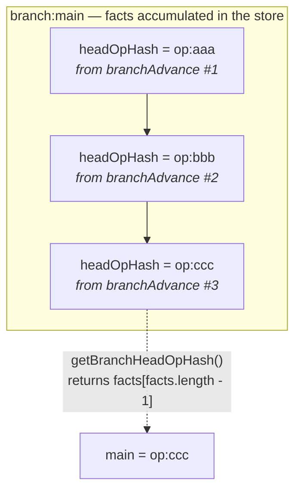
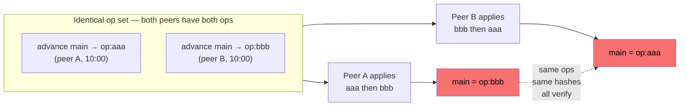
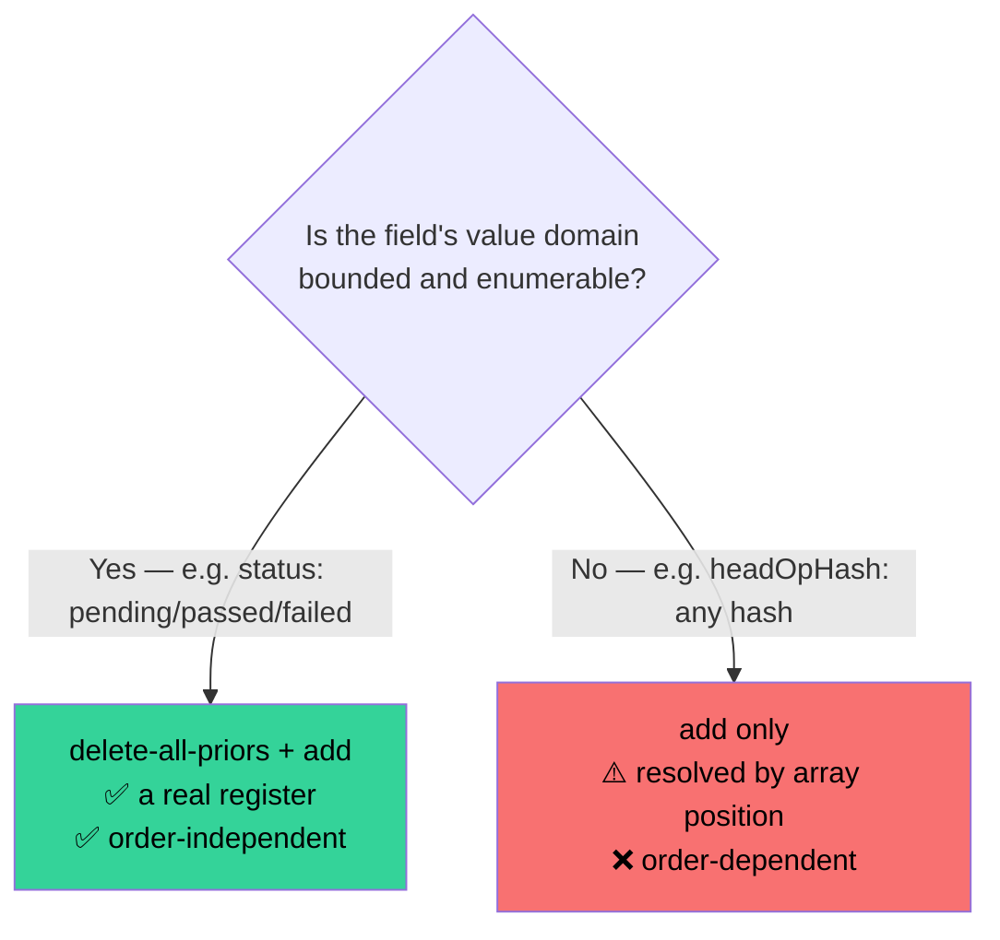
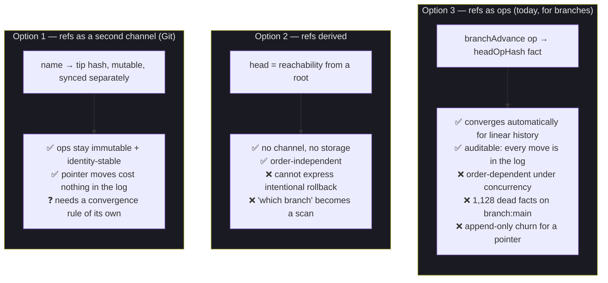
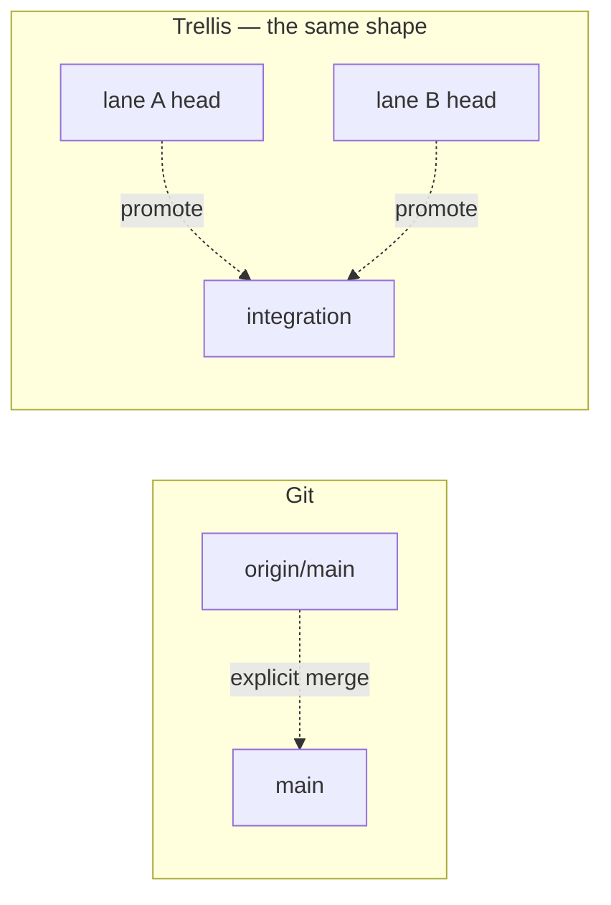
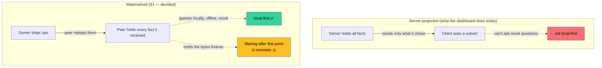
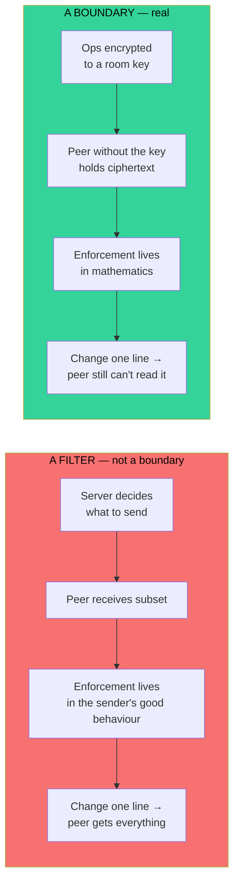
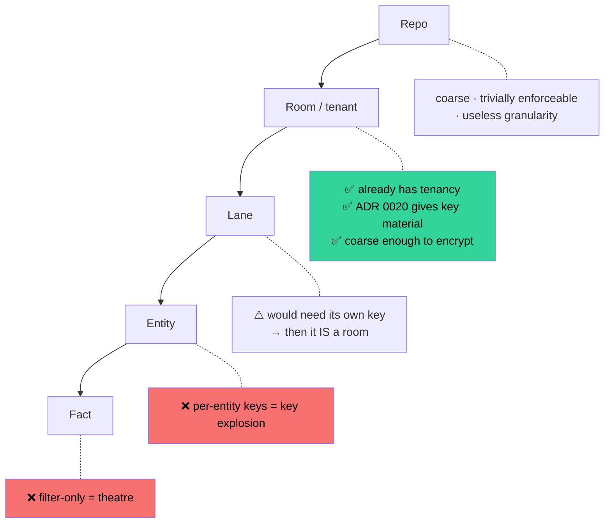
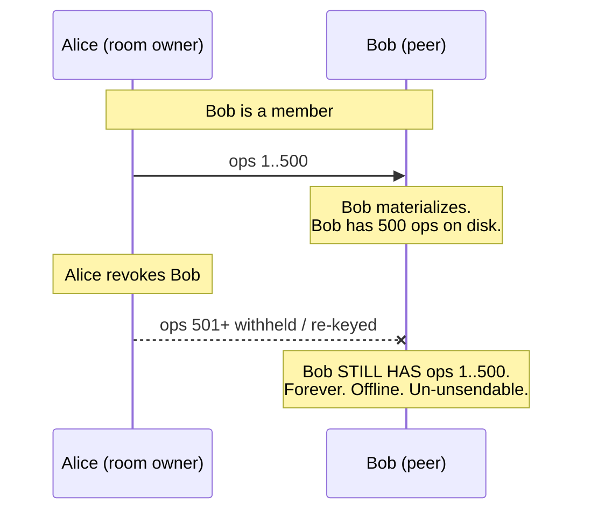
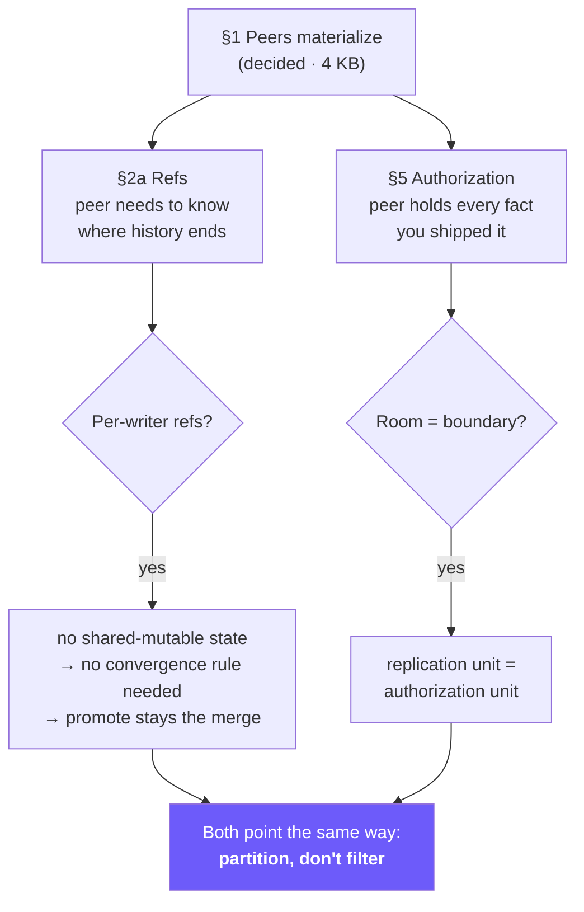

# SPEC-v1.1 — the two open sections, mapped

Companion to `docs/specs/spec-v1.1-graph-op-sync.md`. §1–§4 are settled or
mechanical. **§2a (refs) and §5 (read authorization) are the two that need
decisions**, and they are the two that are genuinely hard. This is the landscape.

---

## Part 1 — §2a: refs

### First, a correction

The spec says "branch and lane heads are mutable side files". **That is wrong for
branches.** `vcs:branchAdvance` decomposes to a fact:

```ts
result.addFacts.push({ e: `branch:${name}`, a: 'headOpHash', v: targetOpHash });
```

Branch heads *are* in the graph. A peer replaying every op **does** learn what
`main` points at. `state.json` holds only `currentBranch` — a name, not a hash —
which is local checkout state and correctly local.

So the model isn't "refs live outside the graph". It's worse and more interesting.

### The actual problem: refs are order-dependent registers



`branchAdvance` **only adds**. It never deletes the prior head. So `branch:main`
accumulates one `headOpHash` fact per advance — **1,128 of them in this repo
today**, out of 3,077 `branchAdvance` ops total — and the head is resolved
positionally:

```ts
// src/vcs/branch.ts:42 — "latest wins"
return facts[facts.length - 1]?.v;
```

**Insertion order decides the answer.** And insertion order is op *application*
order, which for concurrent advances is *arrival* order.



Two peers. Same ops. Every hash verifies. Set union is complete. **And they
disagree about `main`.**

This is the session's recurring bug in its purest form: **correctness depends on
something the hash does not cover.** ADR 0021 was "the hash doesn't cover the
payload". TRL-102 was "the hash doesn't cover the lane, but we mutated it anyway".
This is *"the hash doesn't cover order, and order is the answer."*

### Why `branchAdvance` can't just delete the old fact

`criterionUpdate` gets this right:

```ts
for (const prior of ['pending', 'passed', 'failed'])
  result.deleteFacts.push({ e: ceid, a: 'status', v: prior });
result.addFacts.push({ e: ceid, a: 'status', v: newStatus });
```

Delete-then-add — a proper register. It works because **the domain is bounded**:
three possible values, so you can enumerate and delete them all.

`headOpHash`'s domain is **every hash that has ever existed**. You cannot
enumerate the priors, so you cannot delete them. The register degrades into an
append log resolved by position.



> **This generalizes beyond refs.** Any unbounded-domain "latest wins" field in
> Trellis has this property. Worth an audit — `getLast()` in `issue.ts` uses the
> same `matches[matches.length - 1]` pattern for `description`, `command`,
> `lastOutput`. Single-writer today, so it doesn't bite. It bites the moment
> there are peers.

### The three options



### The insight I'd build on: Git doesn't converge refs — it namespaces them

Git never merges `main` for you. It gives you `main` and `origin/main` and makes
the merge **explicit and local**. Refs are *per-peer*; convergence is a human (or
agent) decision, not a protocol guarantee.

**Trellis already has this and calls it lanes.**



A lane **is** a per-peer ref. `promote` **is** the explicit merge. The model was
right all along — it's just stored inconsistently: **branch heads are facts,
lane heads are `meta.json` files.** One of the two is wrong, and the concurrency
argument says it's the facts.

**Recommendation:** refs are per-writer and namespaced, never shared-mutable.
Then no convergence rule is needed — because two peers never write the same ref.
`main` is *my* main; yours is `peer:you/main`. Promote stays the explicit merge
it already is.

### Questions to settle

1. Do lane heads move into the graph, or branch heads move out to a ref store?
   (They disagree today; one has to move.)
2. If refs are per-writer, what identifies a writer — `agentId`, device key
   (ADR 0020), or lane?
3. Do the 1,128 accumulated `headOpHash` facts get compacted, or is that history
   worth keeping? (It is arguably a genuine audit trail of where `main` has been.)
4. Is there any shared-mutable ref left after per-writer namespacing? If yes, it
   needs a convergence rule and that rule needs a spec.

---

## Part 2 — §5: read authorization

### The shape of the problem



**Materialization doesn't create the authorization problem. It removes the place
you were hiding it.** With projections you can *pretend* per-fact authorization
is real, because the server silently declines to send things. Once a peer
materializes, that pretense is gone: it has what you shipped, permanently.

### Filter vs boundary



This is the same argument that killed lane-scoped sync as a security concept:
**once the bytes land, the filter is cosmetic.** A lane is either a real boundary
— in which case it needs its own key and it *is* a room — or it's a naming
convenience.

> Trellis has already rejected this pattern once, in `rule Read`: a UI affordance
> cosplaying as security. Don't let it back in via the transport.

### The candidate boundaries



### The part that has no nice answer: revocation



**You cannot un-ship bytes.** Revocation can only mean "no *future* ops" —
rotate the key, re-encrypt going forward. Everything already replicated stays
readable by the revoked peer, offline, permanently.

This is not a Trellis flaw; it's true of every E2EE group. But it must be *said*,
because "revoke access" in a local-first system means something weaker than it
does in a server-owned one, and users will assume the server-owned meaning.

**The operational rule that follows:** *ship no room to a peer you would not show
the whole room to, forever.*

### Questions to settle

1. Is the room the boundary? (Recommended — it's the only unit with tenancy and
   key material already.)
2. What is a room, exactly — a tenant, a repo, or a new construct? Today
   `TenantPool` exists and rooms are a server concept; peers have no notion.
3. Are ops encrypted at rest per-room, or is the boundary only "who do we send
   to"? **The second is a filter.** If we want a boundary, it's the first.
4. Does revocation exist at all, or is the honest word "rotate"?
5. Do lanes need to be rooms? If a lane must be private, the answer is forced.

---

## How the two interact



Both sections resolve to the same principle. **Refs:** don't share a mutable
pointer between writers — give each writer its own and merge explicitly.
**Authorization:** don't filter a shared stream — partition it and give each
partition a key. In both cases the failure mode is *pretending two parties share
one thing when they don't*, and in both cases the fix is to stop pretending.

Which is, once more, the same shape as the two-log split: one thing that was
actually two, papered over.
