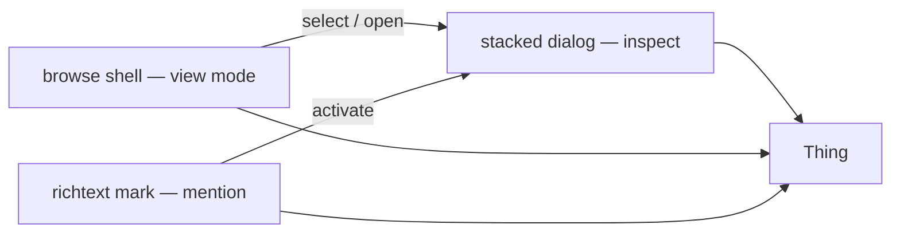
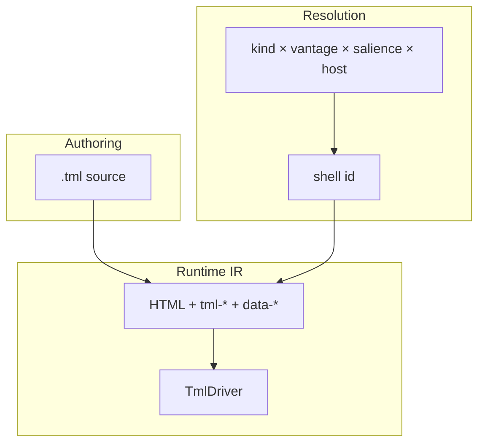
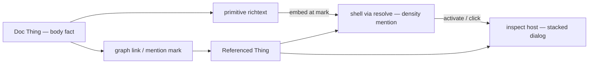

# TML Shell DSL — north-star authoring language

**Status:** north-star / non-normative (planning)  
**Date:** 2026-07-24  
**Fixture:** [`sandbox/tml-admin/`](../../sandbox/tml-admin/)  
**Related:** [`tml-thing-shell-primitive.md`](./tml-thing-shell-primitive.md) · [`tml-v0.md`](../specs/tml-v0.md) · ADR 0025 · [`tml-renderer-pack-registry-proposal.md`](../specs/tml-renderer-pack-registry-proposal.md)

> **One language, HTML as IR.** `.tml` is the desired **authoring** form. Today’s `tml-*` attributes + shell registry remain the **runtime IR** until a compiler exists. Every substantive example below is a **twin**: DSL, then resolved HTML.

**Not in this document’s scope:** shipping a parser, rewriting `admin.html`, or blocking Phase 4–5.

---

## 0. Three primitives to nail early

Before DSL compiler polish, lock these **host primitives** — they carry most of Operate UX:

| # | Primitive | Job |
| - | --------- | --- |
| **1** | **Stacked dialog / inspect host** | Activate Thing → push inspect frame (preview + Properties · References · Activity). Variants: dialog stack · sidebar · fullscreen · floating canvas node |
| **2** | **Richtext** (mentions + slash) | Default text surface. Mentions = mention-density shells → activate → #1. Slash = insert blocks / run allowlisted ops. **UX north star: Notion.** Best public reference: [Plate](https://github.com/udecode/plate) (Slate + React + shadcn-style registry) |
| **3** | **Browse shell** | One projection query, many **view shells**: grid · list · table · kanban · calendar · … Same Things; chrome + density change. Pattern already lives across turtlecode / trellis-client / Raster / Toolkit |



**Test bed:** trellis-node **admin** for #1 and #2 (locked). Scope docs: [`primitive-stacked-dialog.md`](./primitive-stacked-dialog.md) · [`primitive-richtext.md`](./primitive-richtext.md).

**Why this order:** #1 is chrome + stack policy. #3 is resolve × view mode. #2 is the largest product bet — own a **mark/doc IR** + slash→op bridge. Do **not** wait on `.tml` compile.

**Scope before build:** lock #1 and #2 before implementing either or starting #3. Phase 4–5 not blocked; stack/richtext can land as parallel admin wedges.

**Activity tab:** one feed — op/change history **and** ad-hoc comments (not separate top-level tabs).

**Inspect shells:** universal **host** chrome + **fallback** `thing.inspect` + **per-kind** preview shells via resolve — not one mega-dialog per kind and not a single shell that switches on every type.

**Plate / Slate:** [Plate](https://github.com/udecode/plate) and [Slate examples](https://www.slatejs.org/examples/richtext) are **references** (and fine spike substrate). **Owning** a Notion-class richtext primitive — TrellisDoc, mention→inspect, slash→ops — *is* the point; avoid only accidental demos without those contracts. TipTap may remain an adapter in Vue hosts.

**Browse:** `projection` + `resolve` keyed by `view` / density. Open → #1; rich cells → #2. Scope #3 after #1+#2 stick.

---

## 1. Why this exists

Attribute soup (`tml-*`, `data-trellis-*`, `tml-attr-data-*`, `data-shell-*`) is a DX smell. The fractal model is clear — Thing → resolve → shell → optional primitive — but authoring was never given a grammar of its own.

This DSL is that grammar. It does **not** replace:

- Graph data (Things / facts)
- Theme tokens
- Primitive engines (datatable, viewport, motion)
- Framework SDKs for **external** apps

It replaces **hand-authored projection HTML** as the source of truth for shells, projects, and resolve tables.

---

## 2. Layered model



| Layer | Answers | DSL form |
| ----- | ------- | -------- |
| Thing data | What facts exist | `@issue.title` |
| Resolve | Which shell | `resolve kind { when … }` |
| Shell | How it looks at this density | `shell issue.card { … }` |
| Host / project | Query + loop + live | `project … { each … use … }` |
| Formula | Pure derived display / predicates | `let` / `=expr` |
| Op | Allowlisted mutations | `action` / `op` |
| Primitive | Heavy engines | `primitive id` → TS mount |

---

## 3. Lexicon (compact form)

Canonical shape:

```tml
shell issue.card (kind: issue, density: card) {
  button[entity=@issue.id, status=@issue.status] {
    #id      { @issue.id }
    #title   { @issue.title }
    #meta {
      @issue.priority?
      @issue.laneIds?
    }
  }
}
```

| Construct | Meaning |
| --------- | ------- |
| `shell <id> (kind:, density:)` | Registry id ≠ density role |
| `tag[prop=…]` | Structure; props are **semantic**, not raw HTML attrs |
| `#slot` | Authored address (theme, DevTools, IDE grep) |
| `@path` | Bind field path |
| `@path?` | Bind if truthy |
| `let` / `=` | Formula (constrained; see §6) |
| `action` / `op` | Mutation via `TmlDriver.op` |
| `project` | Host: query + each + live + use |
| `resolve` | Which shell id to use |
| `each` / `use` | Loops (host or nested) |
| `motion { enter/exit }` | Optional presence tokens (CSS / View Transitions) |
| `primitive` | Mount an engine pack |

### Prop → IR (today’s dialect)

| DSL | IR (approx. current admin) |
| --- | -------------------------- |
| `density: card` | `data-trellis-shell="card"` |
| `kind: issue` | `data-kind="issue"` |
| `entity=@x` | `tml-attr-data-entity-id="…"` |
| `#title { @issue.title }` | element + `data-trellis-slot="title"` + `tml-text` |
| `shell` registry id on template | `data-trellis-shell="issue.card"` on `<template>` *(split from density — see attribute taxonomy)* |

North-star attribute split (future IR): `data-tml-shell` = registry id; `data-trellis-shell` = density only. Sandbox `ir/` still mirrors **live admin** where they collide.

---

## 4. Twin: issue.card

**DSL** — also [`sandbox/tml-admin/shells/issue.card.tml`](../../sandbox/tml-admin/shells/issue.card.tml):

```tml
shell issue.card (kind: issue, density: card) {
  button[entity=@issue.id, status=@issue.status] {
    #id      { @issue.id }
    #title   { @issue.title }
    #meta {
      let priorityClass = "priority-badge " + (@issue.priority || "low")
      @issue.priority
      @issue.laneIds?
    }
  }
}
```

**Resolved HTML IR** — [`sandbox/tml-admin/ir/issue.card.html`](../../sandbox/tml-admin/ir/issue.card.html):

```html
<template id="shell-issue-card" data-trellis-shell="issue.card">
  <button type="button" class="issue-card" data-trellis-shell="card" data-kind="issue"
    tml-attr-data-entity-id="issue.id" tml-attr-data-status="issue.status">
    <div class="issue-id" data-trellis-slot="id" tml-text="issue.id"></div>
    <div class="issue-title" data-trellis-slot="title" tml-text="issue.title"></div>
    <div class="issue-meta" data-trellis-slot="meta">
      <span tml-text="issue.priority"
        tml-attr-class="'priority-badge ' + (issue.priority || 'low')"></span>
      <span tml-if="issue.laneIds" tml-text="issue.laneIds"></span>
    </div>
  </button>
</template>
```

---

## 5. Salience & resolve

**Resolver-first.** Salience feeds *which* shell; shell bodies stay projections. Slot-level `when salience.*` is an escape hatch.

```tml
resolve issue {
  when salience.focal           -> issue.detail
  when vantage <= 3             -> issue.pip
  when vantage <= 6             -> issue.row
  when host == kanban           -> issue.card
  else                          -> issue.card
}
```

| Signal | Source |
| ------ | ------ |
| `focal` | selection / route / committed hover |
| `attention` | unread, blocked, assignee=me, … |
| `budget` | viewport / list collapse |
| `vantage` | `--ui-vantage` / `data-ui-vantage` |
| `host` | kanban \| grid \| table \| … |

Fixture: [`sandbox/tml-admin/resolve/`](../../sandbox/tml-admin/resolve/).

---

## 6. Formulas

Pure derived **presentation** and **predicates** — not free JS (ADR 0025).

**Allowed:** field paths, literals, `+` concat, `||` `&&`, comparisons, `?` presence, context (`vantage`, `salience`, `host`, `me`).  
**Forbidden:** arbitrary JS calls, graph writes, `fetch`, loops (use `each`).

**Live updates:** yes when the host is `live` — same re-render path as `tml-text`.

Promote repeated formulas to **graph fields** when multiple shells share the meaning.

---

## 7. Loops

**Host loop** (collection → shells):

```tml
project work.grid {
  query: find ?e where type = 'Lane'
  each lane in lanes
  live
  ref lanes-board
  use lane.card
}
```

**HTML IR:**

```html
<div tml-query="find ?e where type = 'Lane'" tml-each="lane of lanes"
  tml-live tml-ref="lanes-board">
  <div data-shell-slot="lane.card"></div>
</div>
```

**Nested loop** inside a shell:

```tml
#children {
  each child in @issue.children {
    use issue.pip
  }
}
```

Prefer **pin** (`use issue.pip`) inside shells; **resolve** at host boundaries.

---

## 8. Ops & MCP

Today’s UI allowlist (`POST /api/tml-mutations`):

| Action | Args |
| ------ | ---- |
| `promote` | `{ id }` |
| `updateLaneMeta` | `{ id, targetBranch?, issueId? }` |

**Shared capability registry** (north-star): one catalog for MCP / UI / CLI with `surfaces: [mcp\|ui\|cli]`. Shells only see `ui`. Do **not** mirror every MCP tool as a button.

Prefer **generic verbs** (`remove`, `create`, `update`, `set`, `promote`) with entity id / kind in args — not per-type names (`removeTodo`). Kind is implied by id prefix or bind scope.

```tml
action remove {
  op remove(@todo.id)    # not removeTodo(@todo.id)
  label "Remove"
}
```

---

## 9. A11y

Interactive roots derive accessible name:

1. Explicit `label=@…` / `label="…"`
2. Else `#title` text
3. Else kind + `#id`
4. Else `entity` string

`#meta` decorative by default (`aria-hidden`) unless `expose`. No DOM `#id` from entity ids — use `entity` data attrs.

---

## 10. Motion, frameworks, 3D

| Concern | Decision |
| ------- | -------- |
| Motion | CSS/theme + optional `motion { enter/exit }` tokens; anime.js = **primitive** |
| React/Vue/Svelte | **Not** in shells; OK as **primitive flavors** or external apps |
| Complex 3D | Museum / Threlte + SDK; TML = HUD + `primitive viewport` |

---

## 11. UI state vs graph

| Off-graph | On-graph |
| --------- | -------- |
| Dialog open, scroll, search, focus, local vantage scrub | Titles, status, lane meta, shared selection |

Optional later: driver `ui:` bag for formulas without ontology cosplay.

---

## 12. Filesystem & packs

```
src/ui/   (or desk project)
  shells/*.tml
  projects/*.tml
  resolve/*.tml
  primitives/*.ts
  theme/runtime-theme.css
  index.html          # thin chrome host
```

Reference Operate tree: [`sandbox/tml-admin/`](../../sandbox/tml-admin/).  
Packs (`trellis shell add`) copy into `shells/` (and optionally `resolve/`). Extension: **`.tml`**.

Icons (future): logical registry beside theme (`icon status/in_progress`) — scaffold exists in trellis-client; **not** in trellis-node admin yet.

---

## 13. Todo app example (minimal)

Teaches shells + project + op without Operate chrome.

**DSL:**

```tml
shell todo.row (kind: todo, density: row) {
  label[entity=@todo.id] {
    #done {
      # checkbox → future op toggle; v0: status text
      @todo.done
    }
    #title { @todo.title }
  }
  action remove {
    op remove(@todo.id)
    label "Remove"
  }
}

project todo.list {
  query: find ?e where type = 'Todo'
  each todo in todos
  live
  ref todos
  use todo.row
}

resolve todo {
  else -> todo.row
}
```

**HTML IR (sketch):**

```html
<template data-trellis-shell="todo.row">
  <label data-trellis-shell="row" data-kind="todo"
    tml-attr-data-entity-id="todo.id">
    <span data-trellis-slot="done" tml-text="todo.done"></span>
    <span data-trellis-slot="title" tml-text="todo.title"></span>
  </label>
  <button type="button" tml-op="remove(todo.id)">Remove</button>
</template>

<div tml-query="find ?e where type = 'Todo'" tml-each="todo of todos"
  tml-live tml-ref="todos">
  <div data-shell-slot="todo.row"></div>
</div>
```

Prefer **generic** registry verbs (`remove`, `create`, `update`, `promote`) keyed by entity id / kind — not `removeTodo` / `addTodo`. Type comes from the id (or bind scope), same as MCP delete/update. Teaching surface for the registry; `remove` is not in today’s admin allowlist yet (`promote`, `updateLaneMeta` only).

Fixture copy: [`sandbox/tml-todo/`](../../sandbox/tml-todo/).  
**Five-surface twin** (TML · HTML · React · Vue · Svelte): [`sandbox/tml-todo/crosswalk/`](../../sandbox/tml-todo/crosswalk/).

---

## 13b. Crosswalk — same app, five surfaces

Teaching aid: one todo list expressed five ways. **Operate stays TML**; framework files show external SDK equivalence, not an alternate admin stack.

| Surface | File |
| ------- | ---- |
| TML DSL | [`crosswalk/todo.tml`](../../sandbox/tml-todo/crosswalk/todo.tml) |
| HTML IR | [`crosswalk/todo.html`](../../sandbox/tml-todo/crosswalk/todo.html) |
| React | [`crosswalk/TodoList.tsx`](../../sandbox/tml-todo/crosswalk/TodoList.tsx) |
| Vue | [`crosswalk/TodoList.vue`](../../sandbox/tml-todo/crosswalk/TodoList.vue) |
| Svelte | [`crosswalk/TodoList.svelte`](../../sandbox/tml-todo/crosswalk/TodoList.svelte) |

Construct map (abbreviated):

| TML | HTML IR | Framework |
| --- | ------- | --------- |
| `project` + `live` | `tml-query` + `tml-live` | `useEntities({ type: 'Todo' })` |
| `each` | `tml-each` | `map` / `v-for` / `{#each}` |
| `#title { @todo.title }` | `tml-text` | `{todo.title}` |
| `op remove(@todo.id)` | `tml-op="remove(…)"` | `remove(id)` from `useMutation` |

Full table: [`crosswalk/README.md`](../../sandbox/tml-todo/crosswalk/README.md).

---

## 13c. HTML-adjacent flavor (Svelte-compiler-shaped)

Two surface syntaxes, **one AST**. Brace form stays valid; this flavor is for humans who want HTML familiarity.

### Naming: `projection` not `project`

`project` reads as a verb (“project these rows”) *and* collides with “software project.” Prefer the noun **`projection`** — a named query host that fills shells.

```html
<projection id="todo.list" live ref="todos"
  query="find ?e where type = 'Todo'">
  <use shell="todo.row" each="todo of todos" />
</projection>
```

Folder rename (north-star): `projects/` → `projections/`. Sandbox may lag until we bulk-rename.

### Root tags are normal HTML — not Vue `<template>`

`<article>`, `<button>`, `<tr>`, `<label>` are **whatever the shell’s root should be in the DOM**. Only this lane card used `<article>`; issue cards use `<button>`, table shells use `<tr>`. There is no required wrapper analogous to Vue’s `<template>` — `<shell>` is the compile-time boundary; its first element child is the runtime root.

### Lets live outside `<shell>` (no script tag required)

Svelte-style: pure bindings at file scope, not inside the shell tree.

```html
let opsLabel = "ops " + lane.opCount + " · files " + lane.fileCount

<shell id="lane.card" kind="lane" density="card">
  <article entity={lane.id} status={lane.status}>
    <slot name="id">{lane.id}</slot>
    <slot name="meta">{opsLabel}</slot>
    <button type="button" on:op={promote(lane.id)}>Promote</button>
  </article>
</shell>
```

Optional `<script>` only if you want an explicit module boundary; default is bare `let` above the shell.

### Why `resolve` is often a separate file

| Separate `resolve/issue.tml` | Inline / colocated |
| ---------------------------- | ------------------ |
| One policy for all projections of that kind | Handy for a single-screen app |
| Agents edit density rules without opening every shell | Shell file stays self-contained |
| Matches “resolver-first salience” | Fine for todo demos |

**Not mandatory.** Allow:

```html
<!-- colocated -->
<resolve kind="todo">
  <when salience.focal then="todo.detail" />
  <else then="todo.row" />
</resolve>

<projection id="todo.list" …>
  <use shell="todo.row" each="todo of todos" />
</projection>
```

Convention: **shared kinds → `resolve/*.tml`**; one-off apps may colocate.

### Directive style (`each` / `when`) over block syntax

Agree with the Vue lean: **attributes on the element** beat Svelte `{#each}` blocks for TML — fewer nest levels, greppable, fits `<use>` / `<slot>`.

```html
<!-- list -->
<use shell="todo.row" each="todo of todos" />

<!-- conditional shell (pin) -->
<use shell="todo.detail" when="salience.focal" />
<use shell="todo.row" when="!salience.focal" />

<!-- conditional slot content -->
<slot name="meta" when="todo.laneIds">{todo.laneIds}</slot>
```

Prefer `each="todo of todos"` (matches today’s `tml-each`) over `todos as todo` unless we deliberately align with Vue’s `v-for="todo in todos"` — recommend **`each="todo of todos"`** for continuity with IR.

`when` on `<use>` is a **local pin** (this call site). Kind-wide policy still belongs in `<resolve>` so you don’t repeat vantage/salience matrices on every projection.

---

### Mentions / references = another vantage of the Thing

A mention is **not** a separate widget type. It’s the same Thing at **mention density** (chip / pip / compact row), embedded in a richtext primitive.

**Default for all text:** any human-authored string field that could gain meaning from links should use the **richtext primitive** (titles may stay plain until they need marks; bodies, notes, descriptions, comments, commit messages in UI — default richtext). Mentions and references must work **everywhere** the same way, not only in “document” surfaces.



**Three layers in practice:**

| Layer | What lives there |
| ----- | ---------------- |
| **Graph** | Durable reference: doc ↔ target (link, mention list, or marks serialized as entity refs — not only plain text) |
| **Richtext primitive** | Host editor adapter: caret, IME, suggester, mark boundaries. **Not** a locked lib in the DSL — TipTap/ProseMirror is the current GUI default where those apps already use it; TUI/AI hosts use other adapters over the same mark model |
| **Shell** | How the target **looks** at mention vantage: `todo.mention`, `issue.pip`, … |
| **Inspect host** | How activation presents the target at denser vantage (below) |

**Authoring (HTML-adjacent sketch):**

```html
<shell id="issue.mention" kind="issue" density="mention">
  <a entity={issue.id} data-trellis-activate="inspect">
    <slot name="label">{issue.id}</slot>
  </a>
</shell>

<shell id="issue.inspect" kind="issue" density="inspect">
  <!-- main preview area — denser projection of the Thing -->
  <slot name="preview">
    <use shell="issue.detail" />
  </slot>
</shell>

<shell id="issue.detail" kind="issue" density="detail">
  <article entity={issue.id}>
    <slot name="title">{issue.title}</slot>
    <slot name="body">
      <primitive richtext bind={issue.body} />
      <!-- marks inside body resolve to *.mention shells -->
    </slot>
  </article>
</shell>
```

**Resolve:**

```html
<resolve kind="issue">
  when density == mention or host == richtext -> issue.mention
  when density == inspect or salience.focal   -> issue.inspect
  …
</resolve>
```

In-flow marks pin `issue.mention` (or resolve at mention density). Activation does **not** invent a one-off popover — it opens the **inspect host**.

### Activate mention → inspect host (canonical)

Shared pattern across turtlecode IDE, trellis-client (Nodebook), Raster, Toolkit v2 (variants differ; stack + tabs richest in trellis-client / turtlecode):

```
┌──────────────────────────────── stacked dialog (resizable) ─┐
│  ┌──────────── main ────────────┐  ┌──── sidebar ─────────┐ │
│  │  preview / projection of      │  │  Properties          │ │
│  │  the Thing (kind shell at    │  │  References /        │ │
│  │  inspect density)            │  │    backlinks         │ │
│  │                              │  │  Activity / ops      │ │
│  │                              │  │    ‖ comments        │ │
│  └──────────────────────────────┘  └──────────────────────┘ │
└─────────────────────────────────────────────────────────────┘
```

**Behavior on click / activate:**

1. Raise `salience.focal` on the target id  
2. **Push** onto an inspect **stack** (origin stays under; scale/dim lower frames; only top interactive)  
3. If target already in stack → **jump / pop-to** that frame (no duplicate)  
4. Back pops; deep-link / hash restore where the host supports it  
5. Nested mentions inside the preview body push further — same stack rules  

**Presentation variants** (same inspect shell + tabs; chrome changes):

| Variant | When |
| ------- | ---- |
| **Stacked dialog** (default GUI) | Resizable modal stack — primary desktop/web |
| **Sidebar / inset** | Docked inspect rail (graph select, IDE EntitySurface) |
| **Fullscreen** | Immersive / mobile sheet / focus mode |
| **Floating node / window** | Canvas / spatial desk — inspect as a windowed node |
| **Tabs / horizontal panes** | Context where stack-of-cards is wrong; still same three sidebar regions |
| **Fractal zoom** | Vantage escalate in-place (board → card → detail) without a separate dialog chrome |
| **VR / spatial** | Easier: walk-to / grab inspect volume; stack = depth layers in space |

Chrome and stack policy are **host concerns**. The Thing still resolves to the same inspect/preview shells + the same three inspector regions (properties · references · activity).

### Non-GUI / constrained hosts

Mentions and inspect must degrade without losing the **meaning** (graph link + open target):

| Host | Mentions look like | Activate does |
| ---- | ------------------ | ------------- |
| **TUI / terminal** | `@id` / styled chip in TUI markup | Push inspect **screen** or split pane (preview + tab strip as keybinds: `p`/`r`/`a`) |
| **E-paper** | Underlined / bold ref; no animation | Full-screen inspect page; no stack chrome — history back |
| **A11y / screen reader** | Announced as “link, {kind}, {label}” | Focus moves to inspect region; tabs are real tablist |
| **AI / MCP / context pack** | Structured ref in pack (`entityId`, kind, label) | Tool: `get_node` / open-in-host; “stack” = conversation focus trail |
| **Plain export (md/pdf)** | Wiki-link or footnote | Dead link or resolved URL if published |

**Invariant:** activate always means **navigate focus to the referenced Thing** at inspect density for that host — never a dead chip.

**Editor UX loop:**

1. User types `@` → primitive opens suggester (query Things)  
2. Pick target → insert mark `{ type: mention, entityId }` + ensure graph link  
3. Render mark → `shellForVantage(kind, mention)`  
4. Activate mark → inspect host push (stacked dialog by default on GUI)  
5. Live updates: target title changes → mention chip rebinds  

**What the primitive must not do:** invent a parallel “MentionCard” tree that bypasses shells, or open an ad-hoc popover that isn’t the shared inspect host.

**Editor dependency (GUI):** TipTap (ProseMirror) is the **practical default** for web/desktop hosts that already share it (trellis-client, turtlecode) — mention extension, Vue/React bindings, collaboration path. It is a **host adapter**, not part of TML grammar or graph schema. Durable body = structured doc + entity-ref marks (JSON/PM doc or a thin Trellis mark IR). Swap adapter without changing mention→inspect semantics.

**Serialization:** structured refs (marks / links), not only `@TRL-1` plain text. Display text from target `#label` / `#title`.

**Reference implementations (pattern sources):**

- trellis-client: `DialogStackHost` + `EntityDialogShell` + `EntityRightSidebar` (Properties \| References \| Activity); TipTap `MentionChip` → stack  
- turtlecode IDE: `createEntityDialogStack` + `EntitySurface` (sidebar twin); TipTap mention → `dialog.push`  
- Raster: same Vue stack host; domain detail dialogs  
- Toolkit v2: `EntityDetailSheet` variants `sheet` \| `dialog` \| `fullscreen` (weaker stacking; still presentation variants)

---

## 14. Generic scaffold (new TML project)

Starting point for humans and agents:

```
my-app/
  trellis.tml.json
  src/
    index.html
    shells/
    projections/            # was "projects" — noun: query hosts
      main.tml
    resolve/
    primitives/
    theme/
      runtime-theme.css
```

**`projections/main.tml` stub (HTML-adjacent):**

```html
<projection id="main" live ref="main"
  query="find ?e where type = 'Thing'">
  <use shell="thing.card" each="thing of things" />
</projection>
```

**Brace form (still valid):**

```tml
projection main {
  query: find ?e where type = 'Thing'
  each thing in things
  live
  ref main
  use thing.card
}
```

**CLI (future):** `trellis tml init [name]` → tree above + empty `thing.card.tml` recipe.  
**MCP (future):** `create_tml_project` with same layout.

Manifest fields (sketch): `host`, `theme`, `ops: ui[]`, `entryProject`.

---

## 15. Editor support (VS Code / Cursor)

| Layer | Timing |
| ----- | ------ |
| **File assoc + TextMate / tree-sitter grammar** | **Not too early** — highlight `shell` / `project` / `@` / `#` on sandbox files now |
| **Snippets** (`shell`, `project`, `resolve`) | Fine early; ship with grammar |
| **LSP: autocomplete ops, jump to shell id, diagnostics** | **Early** until grammar + op registry stabilize and a check CLI exists |
| **Compile-on-save → IR preview** | After compiler spike |

**Recommend:** thin `tml` grammar extension when syntax in this doc feels sticky (post-review); defer LSP to “parser + `trellis shell check`” wedge. Agents already benefit from `.tml` as plain text + this spec as few-shot.

---

## 16. Admin as `.tml` codebase

See [`sandbox/tml-admin/README.md`](../../sandbox/tml-admin/README.md). Mapping:

| Today | Future source |
| ----- | ------------- |
| `<template data-trellis-shell="issue.card">` | `shells/issue.card.tml` |
| Kanban columns | `projects/work.kanban.tml` |
| Grid / table hosts | `projects/work.grid.tml`, `work.table.tml` |
| `setView` | `resolve/*.tml` + `shellForVantage` |
| Datatable / causal graph | `src/ui/*` primitives |
| Sidebar / crumbs | `admin.html` chrome (for now) |

---

## 17. Sequencing

```
Now     Phase 4: wire shellForVantage (runtime)
        Attribute taxonomy cleanup (data-tml-* vs data-trellis-*)
Next    Phase 5: op parity + grow UI allowlist via registry shape
Then    Theme / icon registry companion
Later   Parser + compile sandbox/tml-admin → IR diff
        trellis tml init scaffold
Optional TextMate grammar; LSP after check CLI
```

**Do not** wait on the DSL compiler to finish Phase 4–5. **Do** keep sandbox twins updated when admin shells change.

---

## 18. Open questions

1. Expression ceiling: add `matches` / list length without inviting JS?
2. Nested `use` — always pin, or allow `use resolve`?
3. Pack file layout vs desk `src/ui/shells/` precedence
4. Formula IR encoding before compiler (comments only vs `tml-expr` attr)
5. Inspect host: one universal shell (`thing.inspect`) with slot adapters per kind, or per-kind `issue.inspect`?
6. Activity tab: unify ops timeline vs comments, or keep ‖ (both panels / subtabs)?
7. Which fields stay **plain text** forever (ids, status enums) vs richtext-default?

---

## 19. Defaults locked

- Authoring: `.tml`; runtime IR: HTML + TML attributes  
- Surface flavors: brace form **and** HTML-adjacent (same AST); prefer noun **`projection`** over `project`  
- HTML-adjacent: `each`/`when` directives on `<use>`/`<slot>` (Vue-like), not Svelte `{#each}` blocks; `let` above `<shell>`; root tag = real DOM element  
- Resolve: separate file by convention for shared kinds; colocation allowed  
- Mentions: density/vantage of the target Thing inside richtext — not a separate component family  
- **Richtext = default** for text fields that should support mentions/refs everywhere  
- Richtext **engine**: GUI adapters — [Plate](https://github.com/udecode/plate) as Notion-UX reference (React/Slate/shadcn registry); TipTap/PM where Vue hosts already use it. Not a TML/kernel dependency — durable model is structured marks + entity refs + slash→op  
- **Early wedge:** stacked dialog · richtext (mentions/slash) · browse multi-view — before DSL compiler  
- **Activate mention** → shared **inspect host** (stacked resizable dialog by default): main preview + sidebar tabs Properties · References/backlinks · Activity/ops ‖ comments  
- Inspect **presentation variants** (same shell): sidebar/inset · fullscreen · floating canvas node · tabs/fractal zoom · VR depth; TUI/e-paper/a11y/AI degrade to focus-navigate the Thing  
- Spec examples: always DSL + HTML twins  
- Salience: resolver-first  
- Formulas: pure, live with host  
- Ops: UI ⊆ shared registry with MCP; generic verbs (`remove`, not `removeTodo`)  
- Frameworks / 3D / anime.js: primitives or external — not shell grammar  
- UI chrome state: off-graph by default (stack depth, dialog size, active inspect tab)  
- VS Code: grammar early OK; LSP later  
- Scaffold: `shells/` + `projections/` + `resolve/` + thin `index.html`
