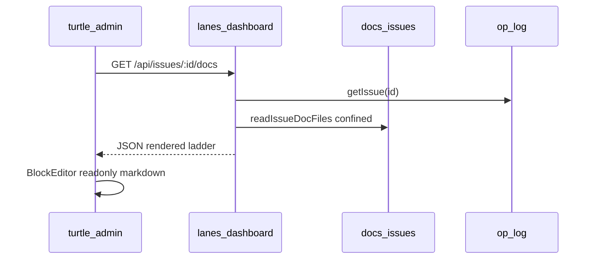

# Spec: turtle-admin — issue dialog long-form docs (read projection)

**Status:** Ready for impl (pending graph issues TRL-463/464)  
**Date:** 2026-10-02  
**Proposal:** TRL-466  
**Spec issue:** TRL-467  
**ADR:** [0057-issue-dialog-docs-read-projection](../adr/0057-issue-dialog-docs-read-projection.md) (Proposed — implement after Accepted)  
**Amends contract:** [0053-admin-operator-api](../adr/0053-admin-operator-api.md) §2, §6  
**Labels:** `spec`, `admin`, `needs-e2e`, `cohesion`  
**Repos:** trellis-node (`kernel/`), turtlenote `app-svelte` + `app-sdk`, `os/admin`

---

## 1. Intent

Populate the turtle-admin **issue record dialog** body with repo markdown
(`journal.md` → `summary.md` → `description` → empty state) via a new operator
read **`GET /api/issues/:id/docs`**. The body is **read-only**; no `RecordBody`
rows in the UI-state db (ADR 0053 §6).

## 2. Non-goals (v1)

- Editable dialog body or HTTP append to `journal.md`
- Asset proxy for `diagram.png` / wiki-links (degraded rendering — ADR 0057 §3)
- `trellis issue doc --journal` scaffold
- Live filesystem watch (staleness until dialog reopen if edit is not op-logged)

## 3. Architecture



| Layer | Change |
| ----- | ------ |
| `src/vcs/issue-doc.ts` | `assertIssueDocId`, `issueDocsRoot`, `issueDocJournalPath`, `readIssueDocFiles` |
| `src/ui/lanes-dashboard.ts` | Route `GET /api/issues/:id/docs` |
| `app-svelte` | `ThingContext.recordBodyMode`; skip `RecordBody` subscription; markdown init |
| `os/admin` | `AdminApi.getIssueDocs`, dialog loader, version-skew fallback, Playwright e2e |

## 4. Engine — `issue-doc.ts`

### 4.1 `assertIssueDocId(id: string): string`

- Strip `issue:` prefix; trim.
- Bare id must match `/^[A-Za-z0-9][A-Za-z0-9._-]*$/`.
- Reject `.`, `..`, empty string.
- Return bare id for path segment (single directory name under `docs/issues/`).

HTTP handler: run **after** `decodeURIComponent` on URL segment. Invalid → **400**
`{ "error": "invalid issue id" }`.

### 4.2 Confinement (normative — ADR 0057 §7)

- `canonicalRoot = realpath(join(rootPath, 'docs', 'issues'))` (+ platform `sep` for prefix checks).
- Files: `join(canonicalRoot, safeSegment, 'journal.md' | 'summary.md')`.
- `realpath` before read; `ENOENT` → `null` for that field.
- Escaped symlink or path → reject read (test-covered).
- Read **at most** `maxBytes` (524_288) at fd; UTF-8 decode; truncate on code-point boundary; `truncated: true`.

### 4.3 Ladder (server authoritative)

| `rendered` | Condition |
| ---------- | --------- |
| `journal` | `journal.md` non-empty after trim |
| `summary` | else `summary.md` non-empty after trim |
| `description` | else non-empty `issue.description` |
| `none` | else |

Response shape: ADR 0057 §6 (`rendered` is authoritative for clients).

## 5. HTTP — `lanes-dashboard.ts`

Insert route **after** existing `GET /api/issues/:id` match:

- `GET /api/issues/:id/docs`
- `engine.open()`; `withGlobalIssueScope` for `getIssue`.
- Unknown issue → 404 (same error shape as `/:id`).
- Known issue → 200 JSON docs payload.

## 6. app-svelte

### 6.1 `ThingContext` (`browse/thing/types.ts`)

Add optional:

```ts
recordBodyMode?: 'ui-db' | 'operator-docs';
```

Default `ui-db` (unchanged apps).

### 6.2 `record-context.ts`

When `appId === 'issues'` and `databaseId === 'issues'`, set `recordBodyMode: 'operator-docs'`.

### 6.3 `record-page.svelte`

When `recordBodyMode === 'operator-docs'`:

- Do **not** call `pages?.page(item.id)` for body (no `RecordPage` / `RecordBody` subscription).
- Load markdown via injected loader (admin passes `getIssueDocs`).
- `BlockEditor`: `readonly={true}`, no `onChange`.
- If `rendered === 'none'`, show empty-state copy from ADR §2.
- Trust server `rendered` + matching field only.

### 6.4 `block-editor.svelte`

Support initial **markdown** string (TipTap `Markdown` extension parse) for operator-docs mode. Extract parse helper testable by vitest (`sanitize-tiptap-doc.test.ts` pattern).

## 7. turtle-admin (`os/admin`)

### 7.1 `AdminApi`

```ts
getIssueDocs(id: string): Promise<IssueDocsResponse>
```

`GET ${baseUrl}/api/issues/${encodeURIComponent(id)}/docs`

### 7.2 Version skew

On 404 from `/docs`: fall back to `GET /api/issues/:id` for `description` + empty state; show `stats.version` / `stats.source` from snapshot when `/docs` missing (older npm kernel).

### 7.3 Refetch

- On dialog open.
- On SSE `snapshot` while dialog open (`AdminApi.watch` pattern).
- Document staleness in UI (optional footnote) — no fs watch.

### 7.4 Catalog

When body uses `description`, unhide `description` in `issueCatalog` (dynamic or always visible when non-empty).

### 7.5 E2E (P3 — owner: admin)

- Add `@playwright/test`, `playwright.config.ts`, `bun run test:e2e`.
- Fixture repo(s) under `admin/e2e/fixtures/` with Trellis init + issue + `docs/issues/<id>/journal.md`.
- Spec: open board → open issue dialog → assert journal heading/text.
- Spec: issue without docs → assert empty-state string.

## 8. Touch map

| Path | Action |
| ---- | ------ |
| `src/vcs/issue-doc.ts` | Helpers + read |
| `test/vcs/issue-doc.test.ts` | Unit + ladder + whitespace |
| `test/ui/issue-docs-api.test.ts` | HTTP .., %2e%2e, 400, 200, oversize |
| `src/ui/lanes-dashboard.ts` | Route |
| `lab/.../app-svelte/src/browse/thing/types.ts` | `recordBodyMode` |
| `lab/.../app-svelte/src/browse/app/record-context.ts` | issues flag |
| `lab/.../app-svelte/src/components/entity/projections/record-page.svelte` | operator-docs branch |
| `lab/.../app-svelte/src/components/entity/page/block-editor.svelte` | markdown init |
| `os/admin/src/lib/issues/api.ts` | client |
| `os/admin/src/lib/issues/*` | loader + catalog |
| `os/admin/e2e/issue-docs.spec.ts` | Playwright |
| `docs/adr/0057-*.md` | Link TRL-N in **Issues** frontmatter |

## 9. Implementation order

1. P0 Engine (merge before admin depends on route)  
2. P1 app-svelte  
3. P2 admin wiring + vitest  
4. P3 admin Playwright  

## 10. Acceptance criteria

Mirror for `trellis issue ac` on the spec issue:

```text
test -f docs/specs/trellis-admin-issue-docs.md
grep -q assertIssueDocId docs/specs/trellis-admin-issue-docs.md
grep -q '/api/issues/:id/docs' docs/specs/trellis-admin-issue-docs.md
grep -q recordBodyMode docs/specs/trellis-admin-issue-docs.md
grep -q 'RecordBody' docs/specs/trellis-admin-issue-docs.md
grep -q 'rendered' docs/specs/trellis-admin-issue-docs.md
grep -q 'bun run test:e2e' docs/specs/trellis-admin-issue-docs.md
grep -q '0057' docs/specs/trellis-admin-issue-docs.md
```

Executor closure (impl issue or spec extension):

```text
test:pnpm check
test:pnpm test test/vcs/issue-doc.test.ts
test:pnpm test test/ui/issue-docs-api.test.ts
test:pnpm test --filter app-svelte (markdown init unit)
test:cd ../admin && bun run check && bun run test
test:cd ../admin && bun run test:e2e
```

## 11. Related

- ADR [0053](../adr/0053-admin-operator-api.md), [0040](../adr/0040-lane-boundary-oss-and-hosted-platform.md)
- Prior admin specs: `trellis-admin-shell.md`, `trellis-admin-datatable-cell-edit.md`
